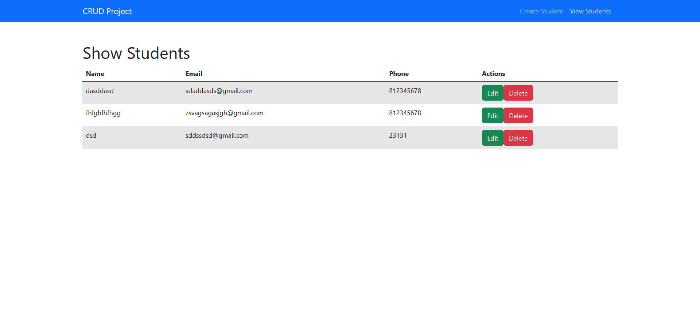

# vuejs-crud-expressjs
- View my project website = https://prachpaveeny.github.io/vuejs-crud-expressjs/
- Project : Vue.js-CRUD-Express.js
- Can create data, modify data, delete data by connecting to MongoDB
- Tools = Node.js(Express.js), MongoDB, Vue.js
</br>

## ขั้นตอนการ Run project
- Run command (Front-end) :
    ```
    $ cd vuejs-crud-expressjs >> npm install >> npm run dev
    ```
- Run command (Back-end) :
    ```
    $ cd backend >> npm install >> npm run dev
    ```


 </br></br>



